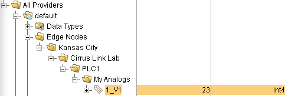

# Symptom

Binary messages received from MQTT Distributor when tag value is changed do not decode properly using [kurapayload.proto](kurapayload.proto).

For instance, decoding the buffer:

`<Buffer 08 96 a9 8d bb 88 2b 12 1c 0a 0f 4d 79 20 41 6e 61 6c 6f 67 73 2f 31 5f 56 31 18 ae a1 8d bb 88 2b 20 03 40 16 18 04>`

throws:

`Error: Illegal wire type for field Message.Field .kuradatatypes.KuraPayload.KuraPosition.latitude: 2 (1 expected)`

# Steps to Reproduce (end-to-end)

Following the "Sending OPC Tag Data with Transmission" example found here: https://docs.chariot.io/display/CLD/Sending+OPC+Tag+Data+with+Transmission

Make sure 1_V1 tag is present using the edge node structure from the example 

Point the mqtt client in [index.js](index.js) to your mqtt server.  Default is _mqtt://localhost_.

Run the commands

```
npm install
npm start
```

Change the value of the 1_V1 tag in the tag browser.

# Steps to Reproduce (unit test)

Sets up a buffer duplicating the inbound message from MQTT Transmission without having to run an MQTT server to reproduce behavior.

```
npm install
npm run test
```
